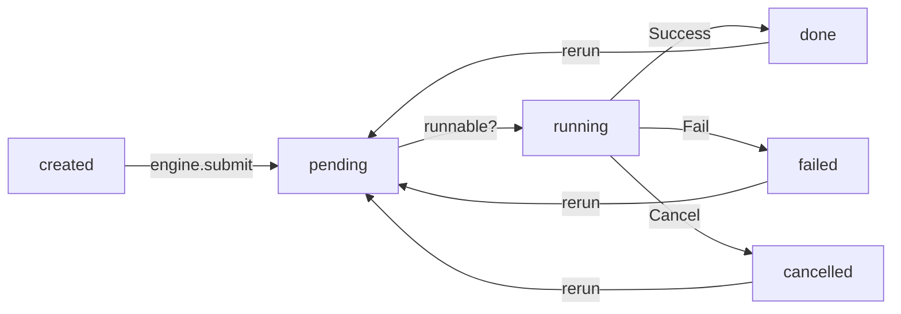

# Getting Started

## 📦 Installation

```bash
pip install executor-engine
```

With dask support:

```bash
pip install "executor-engine[dask]"
```

## 📚 Basic usage

`Engine` is the core object of executor-engine. It manages the job execution.
You can create an `Engine` object and submit jobs to it, then wait for the jobs to finish:

```python
from executor.engine import Engine, LocalJob, ThreadJob, ProcessJob

def add(a, b):
    return a + b

with Engine() as engine:
    job1 = LocalJob(add, args=(1, 2))
    job2 = ThreadJob(add, args=(job1.future, 4))
    job3 = ProcessJob(add, args=(job2.future, 5))
    engine.submit(job1, job2, job3)
    engine.wait()  # wait all job finished
    print(job1.result())  # 3
    print(job2.result())  # 7
    print(job3.result())  # 12
```

Use with asyncio:

```python
from executor.engine import Engine, ProcessJob
import asyncio

engine = Engine()

def add(a, b):
    return a + b

async def main():
    job1 = ProcessJob(add, args=(1, 2))
    job2 = ProcessJob(add, args=(job1.future, 4))
    await engine.submit_async(job1, job2)
    await engine.join()
    print(job1.result())  # 3
    print(job2.result())  # 7

asyncio.run(main())
# or just `await main()` in jupyter environment
```

## 🔄 Job

Job is the basic unit of executor-engine. It represents a task to be executed.

### 🚦 Job status

Job has 6 status: `created`, `pending`, `running`, `done`, `failed`, `cancelled`.

Here is the state transition diagram of job:




### 🧩 Job types

Executor engine provides 4 builtin job types: [`LocalJob`](api-reference/job.md#executor.engine.job.local.LocalJob), 
[`ThreadJob`](api-reference/job.md#executor.engine.job.thread.ThreadJob), 
[`ProcessJob`](api-reference/job.md#executor.engine.job.process.ProcessJob), 
[`DaskJob`](api-reference/job.md#executor.engine.job.dask.DaskJob)

They are executed by different backends and suitable for different scenarios.

| Job type | Backend | Suitable for |
| --- | --- | --- |
| `LocalJob` | `executor.engine.backend.local` | Local function call |
| `ThreadJob` | `executor.engine.backend.thread` | IO-bound tasks |
| `ProcessJob` | `executor.engine.backend.process` | CPU-bound tasks |
| `DaskJob` | `executor.engine.backend.dask` | Distributed tasks |

### 🧰 Extend job types

There are two extend job types:
[`SubprocessJob`](api-reference/extend_job.md#executor.engine.job.extend.SubprocessJob)
and
[`WebappJob`](api-reference/extend_job.md#executor.engine.job.extend.WebappJob)
. They are used to execute shell commands and launch web applications.
The extend job types can based on the job types above(`LocalJob`, `ThreadJob`, `ProcessJob`, `DaskJob`).

#### 🖥️ SubprocessJob

[`SubprocessJob`](api-reference/extend_job.md#executor.engine.job.extend.SubprocessJob)
is a job type for executing shell commands.
`SubprocessJob` accept a shell command as its argument. It will execute the command in a subprocess:

```python
from executor.engine import Engine
from executor.engine.job.extend import SubprocessJob

job = SubprocessJob(
    "python -c 'print(1 + 2)'",
)

with Engine() as engine:
    engine.submit(job)
    engine.wait_job(job)
```


#### 🌐 WebappJob

[`WebappJob`](api-reference/extend_job.md#executor.engine.job.extend.WebappJob) 
is a job type for launching a web application.
It can accept a function with `ip` and `port` as arguments:

```python
from executor.engine import Engine
from executor.engine.job.extend import WebappJob
from http.server import HTTPServer, SimpleHTTPRequestHandler

def run_simple_httpd(ip: str, port: int):
    server_addr = (ip, port)
    httpd = HTTPServer(server_addr, SimpleHTTPRequestHandler)
    httpd.serve_forever()

with Engine() as engine:
    job = WebappJob(run_simple_httpd, ip="127.0.0.1", port=8000)
    engine.submit(job)
    print("Open your browser and visit http://127.0.0.1:8000")
    engine.wait()
```

`WebappJob` can also accept a command template as its argument:

```python
from executor.engine import Engine
from executor.engine.job.extend import WebappJob

with Engine() as engine:
    job = WebappJob(
        "python -m http.server -b {ip} {port}",
        ip="127.0.0.1", port=8000)
    engine.submit(job)
    print("Open your browser and visit http://127.0.0.1:8000")
    engine.wait()
```

### ❓ Conditional job execution

After another job:

```python
from executor.engine import Engine, ProcessJob
from executor.engine.job.condition import AfterAnother

def add(a, b):
    print(f"add({a}, {b})")
    return a + b

with Engine() as engine:
    job1 = ProcessJob(add, args=(1, 2))
    job2 = ProcessJob(add, args=(3, 4), condition=AfterAnother(job_id=job1.id))
    engine.submit(job1, job2)
    # job2 will be executed after job1 finished
    engine.wait()
```

After other jobs:

```python
from executor.engine import Engine, ProcessJob
from executor.engine.job.condition import AfterOthers

def add(a, b):
    print(f"add({a}, {b})")
    return a + b

with Engine() as engine:
    job1 = ProcessJob(add, args=(1, 2))
    job2 = ProcessJob(add, args=(3, 4))
    job3 = ProcessJob(add, args=(5, 6), condition=AfterOthers(job_ids=[job1.id, job2.id]))
    engine.submit(job3, job2, job1)
    # job3 will be executed after job1 and job2 finished
    engine.wait()
```

After a time point:

```python
from executor.engine import Engine, ProcessJob
from executor.engine.job.condition import AfterTimepoint
from datetime import datetime, timedelta

def print_hello():
    print("Hello")

with Engine() as engine:
    now = datetime.now()
    after_5_seconds = now + timedelta(seconds=5)
    job = ProcessJob(
        print_hello,
        condition=AfterTimepoint(timepoint=after_5_seconds))
    # will print "Hello" after 5 seconds
    engine.submit(job)
    engine.wait()
```

See [Condition](api-reference/condition.md) for more details.

#### 🔀 Condition combination

`AllSatisfied` is used to combine multiple conditions, all conditions must be satisfied to execute the job:

```python
from executor.engine import Engine, ThreadJob
from executor.engine.job.condition import AllSatisfied, AfterAnother

s = set()

job1 = ThreadJob(lambda: s.add(1))
job2 = ThreadJob(lambda: s.add(2))

def has_two_elements():
    assert len(s) == 2

job3 = ThreadJob(has_two_elements, condition=AllSatisfied(conditions=[
    AfterAnother(job_id=job1.id),
    AfterAnother(job_id=job2.id)
]))

with Engine() as engine:
    engine.submit(job3, job2, job1)
    engine.wait()
```

!!! info
    When specify the job dependencies using the `JobFuture`
    like `job2 = ProcessJob(add, args=(1, job1.future))`.
    Executor engine will automatically inject a `AllSatisfied([job2.condition, AfterOthers([job1.id])])` condition to the job `job2`.

Similarly, `AnySatisfied` is used to combine multiple conditions, any condition is satisfied to execute the job:

```python
from executor.engine import Engine, ThreadJob
from executor.engine.job.condition import AnySatisfied, AfterAnother
import time

s = set()

def sleep_1s_and_add_1():
    time.sleep(1.0)
    s.add(1)

def has_one_element():
    # when job3 is executed, only job1 is finished
    assert len(s) == 1

with Engine() as engine:
    job1 = ThreadJob(lambda: s.add(1))
    job2 = ThreadJob(sleep_1s_and_add_1)
    job3 = ThreadJob(has_one_element, condition=AnySatisfied(conditions=[
        AfterAnother(job_id=job1.id),
        AfterAnother(job_id=job2.id)
    ]))
    engine.submit(job3, job2, job1)
    engine.wait()
```


#### 🎨 Custom condition

You can also define your own condition by inheriting `Condition` class:

```python
from executor.engine import Engine, ThreadJob
from executor.engine.job.condition import Condition
import random
from dataclasses import dataclass


@dataclass
class RandomCondition(Condition):
    probability: float = 0.5

    def satisfy(self, engine: "Engine") -> bool:
        p = random.random()
        print(f"p={p}")
        if p <= self.probability:
            return True
        else:
            return False


with Engine() as engine:
    job = ThreadJob(
        lambda: print("hi"),
        condition=RandomCondition(0.2),
        wait_time_delta=0.5)
    # job has a 20% chance to be executed at each 0.5 seconds
    engine.submit(job)
    engine.wait()
```

## 🚂 Engine

`executor.engine` provides a `Engine` class for managing jobs.

In non-async mode, engine will launch a thread to run a asyncio event loop, for scheduling jobs.
Before submitting jobs, you should start this event loop by calling `engine.start()`.
And you should stop the event loop by calling `engine.stop()` after all jobs are finished.

```python
from executor.engine import Engine, ProcessJob

def add(a, b):
    return a + b

engine = Engine()
engine.start()
job1 = ProcessJob(add, args=(1, 2))
engine.submit(job1)
engine.wait_job(job1)
print(job1.result())  # 3
engine.stop()
```

The `with statement` is for convenience, it will automatically start and stop the event loop:

```python
from executor.engine import Engine, ProcessJob

def add(a, b):
    return a + b

with Engine() as engine:
    job1 = ProcessJob(add, args=(1, 2))
    engine.submit(job1)
    engine.wait_job(job1)
    print(job1.result())  # 3
```

See the [API reference](api-reference/engine.md) for more details.


### ⚙️ Engine setting

You can set some engine settings by passing a
[`EngineSetting`](api-reference/engine.md#executor.engine.core.EngineSetting)
instance to the `Engine` constructor.
For example, you can set the jobs number limit, turn off
print traceback, etc.

```python
from executor.engine import Engine, EngineSetting, ProcessJob

def add(a, b):
    return a + b

def raise_exception():
    raise Exception("error")

with Engine(setting=EngineSetting(
    max_jobs=1,  # only one job can be executed at the same time
    print_traceback=False,
)) as engine:
    job1 = ProcessJob(add, args=(1, 2))
    job2 = ProcessJob(raise_exception)
    engine.submit(job1, job2)
    engine.wait()
    # job2 will not print traceback
    print(job1.result())  # 3
    print(job2.exception())  # Exception: error
```

More settings are available, see the [API reference](api-reference/engine.md#executor.engine.core.EngineSetting) for more details.

### 🗂️ Jobs manager

All jobs of an engine are managed by a [`Jobs`](api-reference/job_store.md#executor.engine.manager.Jobs) instance.
It caches all jobs on disk, and provides some methods to select jobs by id, status, etc.

```python
from executor.engine import Engine, ProcessJob

def add(a, b):
    return a + b

with Engine() as engine:
    job1 = ProcessJob(add, args=(1, 2))
    engine.submit(job1)
    print(engine.jobs.get_job_by_id(job1.id))  # will print job1
    print(len(engine.jobs.running))  # will print 1
    job2 = ProcessJob(add, args=(3, 4))
    engine.submit(job2)
    print(len(engine.jobs.running))  # will print 2
    engine.wait()
    print(len(engine.jobs.done))  # will print 2
    for job in engine.jobs.done.values():  # iterate all done jobs
        print(job.result())  # will print 3 and 7
```

See the [API reference](api-reference/job_store.md#executor.engine.manager.Jobs) for more details.


## 🚀 Launcher API

`executor.engine` provides a launcher API for launching jobs in more efficient way.

```python
from executor.engine.launcher import launcher
from executor.engine import Engine

@launcher(job_type='process')
def add(a, b):
    time.sleep(1)
    return a + b

with Engine() as engine:
    job = add.submit(1, 2)
    engine.wait_job(job)
    print(job.result()) # 3
```

By passing `async_mode=True` to `launcher`, you can use `await` to launch jobs:

```python
@launcher(async_mode=True)
def add(a, b):
    time.sleep(0.5)
    return a + b

async def main():
    job = await add.submit(1, 2)
    await job.join()
    print(job.result()) # 3

asyncio.run(main())
```

### 💻 Command line launcher

The `launcher` can accept a `cmd2func` 
instance(see [cmd2func](https://github.com/Nanguage/cmd2func) documentation for more details).
In this way, the launcher will launch the `SubprocessJob`
when submitting the job.

```python
from cmd2func import cmd2func
from executor.engine.launcher import launcher
from executor.engine import Engine

@launcher
@cmd2func
def cmd_add(a, b):
    return f"python -c 'print({a} + {b})'"

with Engine() as engine:
    job = cmd_add.submit(1, 2)
    engine.wait_job(job)
    # will print 3 in the console
    print(job.result()) # 0: the return code of the command
```

## 📜 Logging settings

Executor engine use `loguru` as the default logger.
You can configure the logger by importing `executor.engine.log.logger`:

```python
from executor.engine.log import logger

# add file handler
logger.add(sys.stderr, format="{time} {level} {message}", filter="my_module", level="INFO")

# change log-string format
logger.add(sys.stdout, colorize=True, format="<green>{time}</green> <level>{message}</level>")
```

See `loguru` [documentation](https://github.com/Delgan/loguru) for more details.


